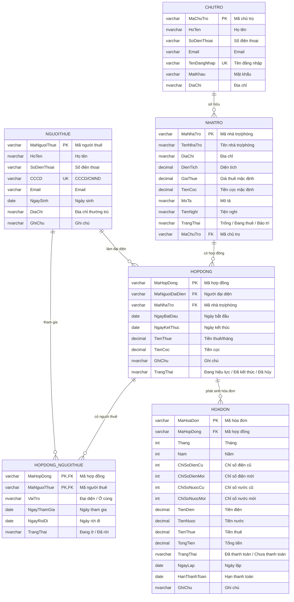

# PROJECT OVERVIEW & GOLDEN RULES

## 1. Tên dự án

**Hệ thống quản lý nhà trọ**

Tên hiển thị trên UI có thể dùng:

```text
Quản lý trọ
Nhà Trọ Pro
```

Dự án là một website quản trị dành cho **1 người dùng duy nhất là chủ trọ**. Hệ thống hỗ trợ chủ trọ quản lý phòng trọ, người thuê, hợp đồng, hóa đơn, công nợ và báo cáo doanh thu.

---

## 2. Mục tiêu dự án

Dự án cần xây dựng một hệ thống quản lý nhà trọ đơn giản, dễ sử dụng, phù hợp với quy mô đồ án sinh viên.

Hệ thống cần hỗ trợ các nghiệp vụ chính:

1. Đăng nhập hệ thống
2. Quản lý nhà trọ/phòng trọ
3. Quản lý người thuê
4. Quản lý hợp đồng thuê phòng
5. Quản lý hóa đơn thanh toán
6. Báo cáo, thống kê doanh thu và công nợ

---

## 3. Phạm vi hệ thống

### 3.1. Trong phạm vi

Hệ thống bao gồm:

- Đăng nhập bằng tài khoản chủ trọ
- Quản lý thông tin phòng trọ
- Quản lý thông tin người thuê
- Tạo hợp đồng cho một phòng
- Một hợp đồng có thể có nhiều người thuê
- Một hợp đồng có một người đại diện ký hợp đồng
- Lập hóa đơn theo hợp đồng
- Tính tiền thuê, tiền điện, tiền nước
- Xác nhận thanh toán hóa đơn
- Theo dõi hóa đơn quá hạn
- Theo dõi công nợ
- Theo dõi doanh thu theo phòng và theo thời gian

### 3.2. Ngoài phạm vi

Không làm các chức năng sau trong phiên bản đồ án:

- Phân quyền nhiều vai trò
- Quản lý nhân viên
- Thanh toán online
- Tích hợp SMS/email thật
- Quản lý tài sản nâng cao
- App mobile riêng
- Kế toán nâng cao
- Xuất hóa đơn điện tử hợp pháp

---

## 4. Tech stack đề xuất

> Nếu codebase thực tế dùng stack khác, vẫn giữ nguyên business rules và ERD bên dưới. Chỉ thay đổi phần kỹ thuật triển khai.

### 4.1. Frontend

```text
React + Vite
Tailwind CSS
React Router
Axios hoặc Fetch API
```

Yêu cầu frontend:

- UI dạng admin dashboard
- Sidebar trái, topbar, content area
- Component rõ ràng, dễ tái sử dụng
- Có form validation
- Có loading state, empty state, error state
- Có pagination cho bảng dữ liệu
- Không hard-code dữ liệu nếu đã có API

### 4.2. Backend

Có thể chọn một trong hai hướng. Nếu chưa có quyết định, ưu tiên hướng A.

#### Hướng A – Node.js

```text
Node.js
Express.js
MySQL 8
Prisma ORM hoặc mysql2
JWT/session cho đăng nhập
```

#### Hướng B – Java

```text
Java Spring Boot
Spring Web
Spring Data JPA
MySQL 8
Spring Security cơ bản
```

### 4.3. Database

```text
MySQL 8.x
Charset: utf8mb4
Collation: utf8mb4_unicode_ci
```

Quy ước:

- Tên bảng có thể dùng PascalCase giống ERD: `ChuTro`, `NhaTro`, `NguoiThue`, `HopDong`, `HopDong_NguoiThue`, `HoaDon`.
- Khóa chính dạng `varchar`, ví dụ: `A101`, `NT001`, `HD001`, `HDON001`.
- Tiền tệ dùng `DECIMAL(18,2)`.
- Ngày dùng `DATE`.
- Trạng thái dùng `NVARCHAR` hoặc `VARCHAR` tùy DB, với MySQL dùng `VARCHAR`/`TEXT` có charset `utf8mb4`.

---

## 5. ERD chính thức

Hệ thống dùng 6 bảng chính:

```text
ChuTro
NhaTro
NguoiThue
HopDong
HopDong_NguoiThue
HoaDon
```

### 5.1. Mermaid ERD



---

## 6. Business rules bắt buộc

Đây là phần quan trọng nhất. Khi AI/code assistant sinh code, tuyệt đối không được làm lệch các rule này.

### 6.1. Rule về phòng trọ

1. Một phòng thuộc về một chủ trọ.
2. Một phòng có thể có nhiều hợp đồng theo thời gian.
3. Một phòng không được có nhiều hơn một hợp đồng đang hiệu lực cùng lúc.
4. Không gán người thuê trực tiếp vào phòng.
5. Người thuê được gán với phòng thông qua hợp đồng.
6. Trạng thái phòng:
   - `Trống`: không có hợp đồng đang hiệu lực
   - `Đang thuê`: có hợp đồng đang hiệu lực
   - `Bảo trì`: do chủ trọ thiết lập thủ công

### 6.2. Rule về người thuê

1. Người thuê lưu thông tin cá nhân trong bảng `NguoiThue`.
2. `CCCD` là duy nhất.
3. Người thuê không có cột `MaNhaTro`.
4. Phòng hiện tại của người thuê được suy ra qua:

```text
NguoiThue → HopDong_NguoiThue → HopDong → NhaTro
```

5. Khi chỉnh sửa người thuê:
   - Cho sửa họ tên, số điện thoại, email, ngày sinh, địa chỉ, ghi chú.
   - Nếu người thuê đã từng tham gia hợp đồng, không cho sửa CCCD.
6. Không xóa người thuê nếu người đó đã từng tham gia hợp đồng.

### 6.3. Rule về hợp đồng

1. Một hợp đồng thuộc về đúng một phòng.
2. Một hợp đồng phải có một người đại diện.
3. Một hợp đồng có thể có nhiều người thuê.
4. Người đại diện phải nằm trong bảng `HopDong_NguoiThue` với `VaiTro = 'Đại diện'`.
5. Những người thuê còn lại trong cùng hợp đồng có `VaiTro = 'Ở cùng'`.
6. Khi tạo hợp đồng:
   - Insert vào `HopDong`.
   - Insert danh sách người thuê vào `HopDong_NguoiThue`.
   - Người đại diện có `TrangThai = 'Đang ở'`.
   - Người ở cùng có `TrangThai = 'Đang ở'`.
7. Khi kết thúc hợp đồng:
   - `HopDong.TrangThai = 'Đã kết thúc'`.
   - Tất cả người trong `HopDong_NguoiThue` chuyển thành `TrangThai = 'Đã rời'`.
   - Gán `NgayRoiDi`.
   - Phòng chuyển về `Trống` nếu không có hợp đồng hiệu lực khác.
8. Không cho đổi phòng nếu hợp đồng đã phát sinh hóa đơn.

### 6.4. Rule về hóa đơn

1. Hóa đơn gắn với hợp đồng, không gắn trực tiếp với phòng hoặc người thuê.
2. Một hợp đồng có thể có nhiều hóa đơn theo tháng.
3. Không tạo 2 hóa đơn cho cùng một hợp đồng trong cùng tháng/năm.
4. Chỉ lập hóa đơn cho hợp đồng đang hiệu lực.
5. Tiền thuê mặc định lấy từ `HopDong.TienThue`.
6. Tiền điện tính trên UI:

```text
TienDien = (ChiSoDienMoi - ChiSoDienCu) * DonGiaDien_UI
```

7. Tiền nước tính trên UI:

```text
TienNuoc = (ChiSoNuocMoi - ChiSoNuocCu) * DonGiaNuoc_UI
```

8. Database không lưu `DonGiaDien` và `DonGiaNuoc`.
9. Database chỉ lưu kết quả `TienDien`, `TienNuoc`, `TongTien`.
10. Tổng tiền:

```text
TongTien = TienThue + TienDien + TienNuoc
```

11. Trạng thái hóa đơn:
   - `Chưa thanh toán`
   - `Đã thanh toán`
12. Hóa đơn quá hạn là hóa đơn có:

```text
TrangThai = 'Chưa thanh toán'
AND HanThanhToan < ngày hiện tại
```

13. Hóa đơn đã thanh toán không được chỉnh sửa số tiền/chỉ số.
14. Không cần chức năng xóa hóa đơn trong bản đồ án. Nếu có, chỉ cho xóa hóa đơn chưa thanh toán và chưa dùng cho báo cáo.

---

## 7. Các module chính

### 7.1. Đăng nhập

Chức năng:

- Nhập tên đăng nhập
- Nhập mật khẩu
- Xác thực với bảng `ChuTro`
- Đăng nhập thành công thì vào Dashboard

Không cần phân quyền nhiều vai trò.

---

### 7.2. Dashboard

Hiển thị:

- Tổng số phòng
- Phòng đang thuê
- Phòng trống
- Hợp đồng đang hiệu lực
- Hóa đơn chưa thanh toán
- Hóa đơn quá hạn
- Doanh thu tháng này
- Biểu đồ doanh thu theo tháng
- Danh sách hóa đơn chưa thanh toán
- Danh sách hợp đồng sắp hết hạn

Dashboard chỉ đọc dữ liệu, không ghi dữ liệu.

---

### 7.3. Quản lý nhà trọ

Chức năng:

- Xem danh sách phòng
- Tìm kiếm phòng
- Lọc trạng thái phòng
- Thêm phòng
- Xem chi tiết phòng
- Chỉnh sửa phòng
- Xóa phòng nếu chưa có hợp đồng

Danh sách phòng nên hiển thị:

- Mã phòng
- Tên phòng
- Địa chỉ
- Diện tích / Giá thuê
- Người đại diện hiện tại
- Số người đang ở
- Trạng thái

Chi tiết phòng nên hiển thị:

- Thông tin chung
- Trạng thái hiện tại
- Người đại diện
- Danh sách người đang ở
- Lịch sử hợp đồng
- Hóa đơn liên quan
- Doanh thu theo phòng

---

### 7.4. Quản lý người thuê

Chức năng:

- Xem danh sách người thuê
- Tìm kiếm theo tên, SĐT, CCCD, phòng
- Lọc theo trạng thái/vai trò
- Thêm người thuê
- Xem chi tiết người thuê
- Chỉnh sửa người thuê
- Xóa nếu chưa từng tham gia hợp đồng

Danh sách người thuê nên hiển thị:

- Họ tên
- SĐT
- CCCD
- Phòng hiện tại
- Vai trò
- Ngày tham gia
- Trạng thái

Không gán phòng trong form người thuê. Việc gán phòng thực hiện khi tạo hợp đồng.

---

### 7.5. Quản lý hợp đồng

Chức năng:

- Xem danh sách hợp đồng
- Tìm kiếm, lọc hợp đồng
- Tạo hợp đồng
- Xem chi tiết hợp đồng
- Chỉnh sửa hợp đồng
- Thêm người ở cùng
- Đánh dấu người thuê đã rời
- Kết thúc hợp đồng
- Xem hóa đơn liên quan

Danh sách hợp đồng nên hiển thị:

- Mã hợp đồng
- Phòng
- Người đại diện
- Số người thuê
- Thời hạn thuê
- Tiền thuê
- Tiền cọc
- Trạng thái

Form tạo hợp đồng bắt buộc có:

- Chọn phòng
- Chọn người đại diện
- Thêm người ở cùng
- Ngày bắt đầu
- Ngày kết thúc
- Tiền thuê
- Tiền cọc
- Ghi chú

---

### 7.6. Quản lý hóa đơn

Chức năng:

- Xem danh sách hóa đơn
- Tìm kiếm, lọc hóa đơn
- Lập hóa đơn mới
- Xem chi tiết hóa đơn
- Chỉnh sửa hóa đơn chưa thanh toán
- Xác nhận thanh toán
- Theo dõi hóa đơn quá hạn

Danh sách hóa đơn nên hiển thị:

- Mã hóa đơn
- Tháng/Năm
- Hợp đồng
- Người đại diện
- Phòng
- Số tiền
- Hạn thanh toán
- Trạng thái

Form hóa đơn bắt buộc có:

- Chọn hợp đồng
- Tháng/Năm
- Ngày lập
- Hạn thanh toán
- Tiền thuê
- Chỉ số điện cũ/mới
- Đơn giá điện trên UI
- Chỉ số nước cũ/mới
- Đơn giá nước trên UI
- Ghi chú
- Tổng tiền tự tính

---

### 7.7. Báo cáo

Chức năng:

- Báo cáo doanh thu theo tháng
- Báo cáo doanh thu theo phòng
- Báo cáo công nợ
- Báo cáo hợp đồng đang hiệu lực
- Báo cáo hóa đơn chưa thanh toán/quá hạn

Doanh thu chỉ tính từ hóa đơn đã thanh toán.

Công nợ tính từ hóa đơn chưa thanh toán.

---

## 8. Trạng thái chuẩn hóa

### 8.1. Trạng thái phòng

```text
Trống
Đang thuê
Bảo trì
```

### 8.2. Trạng thái hợp đồng

```text
Đang hiệu lực
Đã kết thúc
Đã hủy
```

### 8.3. Vai trò người thuê trong hợp đồng

```text
Đại diện
Ở cùng
```

### 8.4. Trạng thái người thuê trong hợp đồng

```text
Đang ở
Đã rời
```

### 8.5. Trạng thái hóa đơn

```text
Chưa thanh toán
Đã thanh toán
```

Trạng thái `Quá hạn` là trạng thái hiển thị, không nhất thiết lưu DB. Tính từ `HanThanhToan`.

---

## 9. API convention gợi ý

Nếu dùng REST API, dùng convention sau:

```text
POST   /api/auth/login
GET    /api/dashboard

GET    /api/rooms
GET    /api/rooms/:id
POST   /api/rooms
PUT    /api/rooms/:id
DELETE /api/rooms/:id

GET    /api/tenants
GET    /api/tenants/:id
POST   /api/tenants
PUT    /api/tenants/:id
DELETE /api/tenants/:id

GET    /api/contracts
GET    /api/contracts/:id
POST   /api/contracts
PUT    /api/contracts/:id
PUT    /api/contracts/:id/end
POST   /api/contracts/:id/tenants
PUT    /api/contracts/:id/tenants/:tenantId/leave

GET    /api/invoices
GET    /api/invoices/:id
POST   /api/invoices
PUT    /api/invoices/:id
PUT    /api/invoices/:id/confirm-payment

GET    /api/reports/revenue
GET    /api/reports/debt
GET    /api/reports/contracts
```

---

## 10. UI/UX golden rules

1. Giao diện dạng admin dashboard.
2. Sidebar trái luôn có:
   - Dashboard
   - Nhà trọ
   - Người thuê
   - Hợp đồng
   - Hóa đơn
   - Báo cáo
   - Tài khoản
3. Topbar có tìm kiếm nhanh và avatar chủ trọ.
4. Table cần có search, filter, pagination.
5. Các trạng thái phải dùng badge rõ màu.
6. Nút chính dùng màu nổi bật.
7. Form chia thành block rõ ràng.
8. Form phải có validation message.
9. Hóa đơn và hợp đồng cần có summary card.
10. Không dùng lorem ipsum trong UI demo. Dùng dữ liệu tiếng Việt thực tế.

---

## 11. Validation rules quan trọng

### 11.1. Phòng

- `MaNhaTro` không trùng.
- `TenNhaTro` không rỗng.
- `DiaChi` không rỗng.
- `DienTich` > 0.
- `GiaThue` >= 0.
- `TienCoc` >= 0.

### 11.2. Người thuê

- `HoTen` không rỗng.
- `SoDienThoai` không rỗng.
- `CCCD` không rỗng và không trùng.
- `NgaySinh` không lớn hơn ngày hiện tại.
- Không sửa CCCD nếu người thuê đã có hợp đồng.

### 11.3. Hợp đồng

- Phải chọn phòng.
- Phòng không được có hợp đồng đang hiệu lực khác.
- Phải chọn người đại diện.
- Người đại diện phải nằm trong danh sách người thuê.
- Danh sách người thuê có ít nhất 1 người.
- Ngày kết thúc > ngày bắt đầu.
- Tiền thuê > 0.
- Tiền cọc >= 0.

### 11.4. Hóa đơn

- Phải chọn hợp đồng.
- Hợp đồng phải đang hiệu lực.
- Không trùng hóa đơn cùng hợp đồng + tháng + năm.
- Chỉ số điện mới >= chỉ số điện cũ.
- Chỉ số nước mới >= chỉ số nước cũ.
- Hạn thanh toán không rỗng.
- Tổng tiền tự tính, không nhập tay.
- Hóa đơn đã thanh toán không được chỉnh sửa số tiền/chỉ số.

---

## 12. Seed data gợi ý

### Chủ trọ

```text
MaChuTro: CT001
HoTen: Nguyễn Văn A
TenDangNhap: admin
MatKhau: admin123
```

### Phòng

```text
A101 - Phòng A101 - Tầng 1, Khu A - 4.500.000đ/tháng
A102 - Phòng A102 - Tầng 1, Khu A - 4.000.000đ/tháng
A103 - Phòng A103 - Tầng 1, Khu A - 5.000.000đ/tháng
A201 - Phòng A201 - Tầng 2, Khu A - 4.500.000đ/tháng
B101 - Phòng B101 - Tầng 1, Khu B - 3.500.000đ/tháng
```

### Người thuê

```text
NT001 - Nguyễn Văn A - Đại diện
NT002 - Trần Văn B - Ở cùng
NT003 - Lê Thị C - Ở cùng
NT004 - Hoàng Văn F - Đại diện
NT005 - Đinh Thị Hoa - Ở cùng
```

### Hợp đồng

```text
HD001 - Phòng A101 - Đại diện Nguyễn Văn A - 3 người - Đang hiệu lực
HD005 - Phòng A102 - Đại diện Hoàng Văn F - 2 người - Đang hiệu lực
HD012 - Phòng A103 - Đại diện Võ Thị G - 4 người - Đang hiệu lực
```

### Hóa đơn

```text
HDON001 - Hợp đồng HD001 - 04/2026 - 4.692.500đ - Chưa thanh toán
HDON015 - Hợp đồng HD001 - 03/2026 - 4.620.000đ - Đã thanh toán
```

---

## 13. Coding rules for AI/Codex

Khi dùng AI/Codex để code, bắt buộc tuân thủ:

1. Không tự ý đổi tên bảng/cột so với ERD.
2. Không thêm bảng phân quyền.
3. Không gán `MaNhaTro` trực tiếp vào `NguoiThue`.
4. Không gán `MaNguoiThue` trực tiếp vào `NhaTro`.
5. Không đưa lại `MaNguoiThue` vào bảng `HopDong`. Dùng `MaNguoiDaiDien` và bảng `HopDong_NguoiThue`.
6. Không tạo hóa đơn trực tiếp theo phòng hoặc người thuê. Hóa đơn phải gắn với hợp đồng.
7. Không lưu đơn giá điện/nước nếu ERD không có cột đó.
8. Không cho chỉnh hóa đơn đã thanh toán.
9. Không cho tạo hợp đồng mới cho phòng đang có hợp đồng hiệu lực.
10. Không cho tạo hóa đơn trùng tháng/năm cho cùng hợp đồng.
11. Luôn validate dữ liệu ở cả frontend và backend.
12. Luôn xử lý lỗi bằng message dễ hiểu tiếng Việt.
13. Dữ liệu hiển thị trên UI dùng tiếng Việt.

---

## 14. Definition of Done

Một chức năng được xem là hoàn thành khi:

- Có UI list/detail/form nếu cần.
- Có API tương ứng.
- Có validation frontend.
- Có validation backend.
- Có kết nối database thật.
- Có xử lý loading/error/empty state.
- Có thông báo thành công/thất bại.
- Không vi phạm business rules.
- Dữ liệu hiển thị đúng theo ERD.
